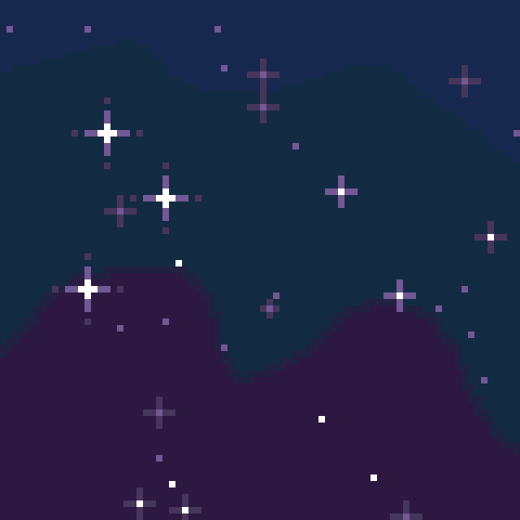

# Simple python code for creating a unique pixel art of a starry night sky

Pixel art created with python pillow library.

# Reminder

Stars look tiny on bigger pictures in case you wan't generate stars on custom picture. So try downscaling your picture with this tool first https://resizeimage.net. (thanks bayartsogt-ya)

## Example picture

